:toc: right

= CLOUDERA DATA WAREHOUSE ICEBERG WORKSHOP


=== はじめに

このハンズオンワークショップでは、Cloudera Data Warehouse で利用可能となった最新のテーブルフォーマットである Apache Iceberg の機能を体験します。


ワークショップの本編は4つのラボで構成されています。

それぞれのラボの概要を下記に説明します。

* *[ラボ 1]: 準備作業*
  ** CDP Public Cloud および Data Warehouse サービスへのアクセス方法やコントロールプレーンの操作方法を習得します
* *[ラボ 2]: Rawデータレイヤーへのアクセス*
  ** Icebergテーブルへロードするデータを準備しながら旧世代のHiveテーブルの機能を復習します
  ** データレイクへ格納されたデータファイルにスキーマを適用し Data Warehouse サービスからのアクセスを可能にします
* *[ラボ 3]: ICEBERGテーブルの作成*
  ** Iceberg テーブルを作成する3つの方法を体験します。
  ** Iceberg を新規に作成する手順の他、既存の Hive テーブルから移行する方法を含め、3つの Iceberg テーブル作成方法を見ていきます
* *[ラボ 4]: ICEBERGの機能*
  ** Iceberg の新機能のうち、Partition-Evolution、スナップショット、タイムトラベルを体験します。
  ** 従来型のテーブルフォーマットでは実現できなかったようなテーブルの保守やパフォーマンスの最適化を行います。

=== 作業環境

* ワークショップ全体を通して、操作は全てWebブラウザで行います
* サポートブラウザはGoogle Chromeです
+
IE、Firefox、Safariはサポート外なので注意してください


=== テストデータ


取り扱うデータは、航空機製造メーカーが保有する航空機運行情報を想定したデータです。

テーブルの種類やボリューム、相関は以下のようなものになります。


* Fact テーブル: 
  ** flights (8,600万行)
* Dimension テーブル: 
  ** airlines (1,500行)
  ** airports (3,300行)
  ** planes (5,000行)


== ラボ 1 - 準備作業

---


このワークショップで使用するログイン情報や環境を確認します

=== 情報の確認とワークショップ環境へのログイン

==== 手順 1 : 情報の確認

ワークショップ環境にログインするためのユーザ名やパスワードは別添の一覧表に記載してあります。講師より一覧表を受け取って内容を確認してください。


|===
| *Workshop Login Username (username)* | <講師よりお知らせします>                         
| *Workshop Login Password*            | <講師よりお知らせします>                         
| *S3 Bucket Name*                     | <講師よりお知らせします>                         
| *Hive Virtual Warehouse Name*        | <講師よりお知らせします>                         
| *Impala Virtual Warehouse Name*      | <講師よりお知らせします>                         
|===


==== 手順 2 : ログイン 

ワークショップ環境のURLにアクセスし、Workshop Login Username/Passwordでログインします。ログインページは以下のようなもので、初回はパスワード変更が要求されます。

image:img_1.png[]


==== 手順 3：Data Warehouse 画面操作

Management Console 左側メニューの Data Warehouses をクリックして、Data Warehouse コンソールを表示します。

image:img_2.png[]


Data Warehouses のコンソール画面が開きます。

画面下に列挙されているものが今回のワークショップで使用する Virtual Warehouse です。

Hive および Impala の計2つの Virtual Warehouse が用意されています。

image:img_3.png[]


== ラボ 2 - RAWデータへのアクセス

---


はじめに、外部のデータソースなどから供給されたインプットデータをHiveからアクセスできるようにします。このワークショップでは、AWSのS3上にテキストのCSVファイルが供給されているものとします。

テキストなどのrawデータに対して、後からスキーマを設定して、HiveのSQLでアクセスできるようにします。このような操作をSchema on Readといいます。

=== データベースとテーブルの作成

==== 手順 1 : Hueの利用（Hive）

Hue は Cloudera Data Platform 上のデータを操作するためのWebアプリケーションです。

Hive Virtual Warehouse Name で示される Virtual Warehouse の右上にある HUE アイコンをクリックします。

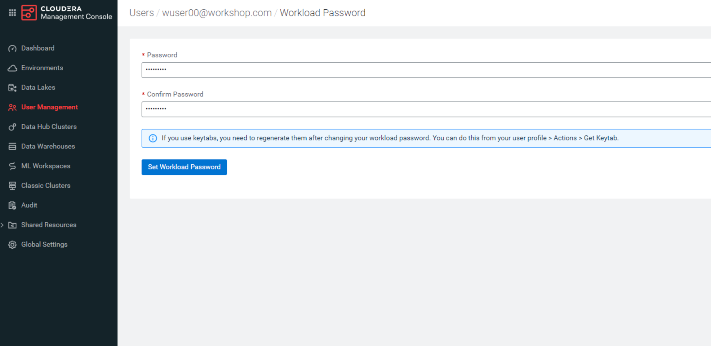


==== 手順 2 : データベースの作成

このワークショップで使うデータベースを作成します。

データベースの作成は CREATE DATABASE 文で行います。CREATE DATABASE 

```sql
CREATE DATABASE ${user_id}_airlines_raw;
CREATE DATABASE ${user_id}_airlines;
```


このSQLを実際にHueのSQLエディタで実行しましょう。

${user_id} はHive変数です。HueではHive変数を検出すると自動的に変数の入力ボックスが表示されます。

また複数行のSQLを実行する場合は、実行したいSQL文をドラッグしてハイライトした状態で実行ボタンをクリックします。

${usre_id} のボックスに自分のユーザ名を入力し、SQL分をハイライトして実行ボタンをクリックします。

image:img_5.png[]


以下のSQLを実行して、実際にデータベースが作成されたことを確認します。

```sql
SHOW DATABASES LIKE '${user_id}%';
```


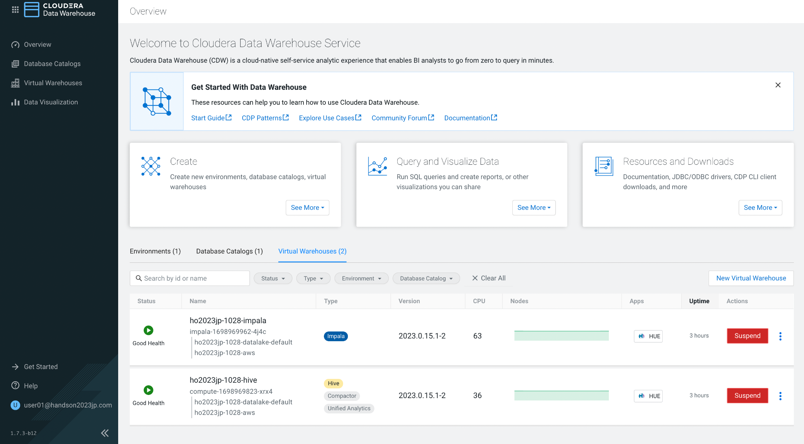


==== 手順 3 : テーブルの作成

AWS S3 に保存されているCSVファイルにスキーマを設定し、HiveのSQLでアクセスできるようにします。

1つ目のSQLを例に、構文を説明します。

```sql
※※※ このSQLは説明用なので実行しないでください ※※※
-- テーブルが存在していた場合は削除
drop table if exists ${user_id}_airlines_raw.flights_csv;

-- Hive外部テーブルの作成
CREATE EXTERNAL TABLE ${user_id}_airlines_raw.flights_csv
(
  month int,
  dayofmonth int,
  dayofweek int ...
-- 中略 --
  securitydelay int, 
  lateaircraftdelay int,
  year int
)
ROW FORMAT DELIMITED 
FIELDS TERMINATED BY ','    -- 項目の区切り文字は','(カンマ)
LINES TERMINATED BY '\n'    -- 行の区切り文字は改行コード
STORED AS TEXTFILE          -- ファイルフォーマットはテキストファイル
LOCATION                    -- ファイルの保存場所  
  's3a://${cdp_env_bucket}/data/airlines-csv/flights'
tblproperties(
  "skip.header.line.count"="1"  -- 先頭1行をヘッダとして読み飛ばす
);
```


同じ構文のSQLで、flights_csv, planes_csv, airlines_csv, airlines_csv の4つのテーブルを作成します。

${user_id} は各自のユーザ名、${cdp_env_bucket} は S3 Bucket Name を入力します。

複数行を実行する場合は、実行するSQLをハイライトしてください。

```sql
--FLIGHTS TABLE
drop table if exists ${user_id}_airlines_raw.flights_csv;
CREATE EXTERNAL TABLE ${user_id}_airlines_raw.flights_csv(month int, dayofmonth int, dayofweek int, deptime int, crsdeptime int, arrtime int, crsarrtime int, uniquecarrier string, flightnum int, tailnum string, actualelapsedtime int, crselapsedtime int, airtime int, arrdelay int, depdelay int, origin string, dest string, distance int, taxiin int, taxiout int, cancelled int, cancellationcode string, diverted string, carrierdelay int, weatherdelay int, nasdelay int, securitydelay int, lateaircraftdelay int, year int)
ROW FORMAT DELIMITED FIELDS TERMINATED BY ',' LINES TERMINATED BY '\n'
STORED AS TEXTFILE LOCATION 's3a://${cdp_env_bucket}/data/airlines-csv/flights' tblproperties("skip.header.line.count"="1");

--PLANES TABLE
drop table if exists ${user_id}_airlines_raw.planes_csv;
CREATE EXTERNAL TABLE ${user_id}_airlines_raw.planes_csv(tailnum string, owner_type string, manufacturer string, issue_date string, model string, status string, aircraft_type string, engine_type string, year int)
ROW FORMAT DELIMITED FIELDS TERMINATED BY ',' LINES TERMINATED BY '\n'
STORED AS TEXTFILE LOCATION 's3a://${cdp_env_bucket}/data/airlines-csv/planes' tblproperties("skip.header.line.count"="1");

--AIRLINES TABLE
drop table if exists ${user_id}_airlines_raw.airlines_csv;
CREATE EXTERNAL TABLE ${user_id}_airlines_raw.airlines_csv(code string, description string) ROW FORMAT DELIMITED FIELDS TERMINATED BY ',' LINES TERMINATED BY '\n'
STORED AS TEXTFILE LOCATION 's3a://${cdp_env_bucket}/data/airlines-csv/airlines' tblproperties("skip.header.line.count"="1");

--AIRPORT TABLE
drop table if exists ${user_id}_airlines_raw.airports_csv;
CREATE EXTERNAL TABLE ${user_id}_airlines_raw.airports_csv(iata string, airport string, city string, state DOUBLE, country string, lat DOUBLE, lon DOUBLE)
ROW FORMAT DELIMITED FIELDS TERMINATED BY ',' LINES TERMINATED BY '\n'
STORED AS TEXTFILE LOCATION 's3a://${cdp_env_bucket}/data/airlines-csv/airports' tblproperties("skip.header.line.count"="1");
```


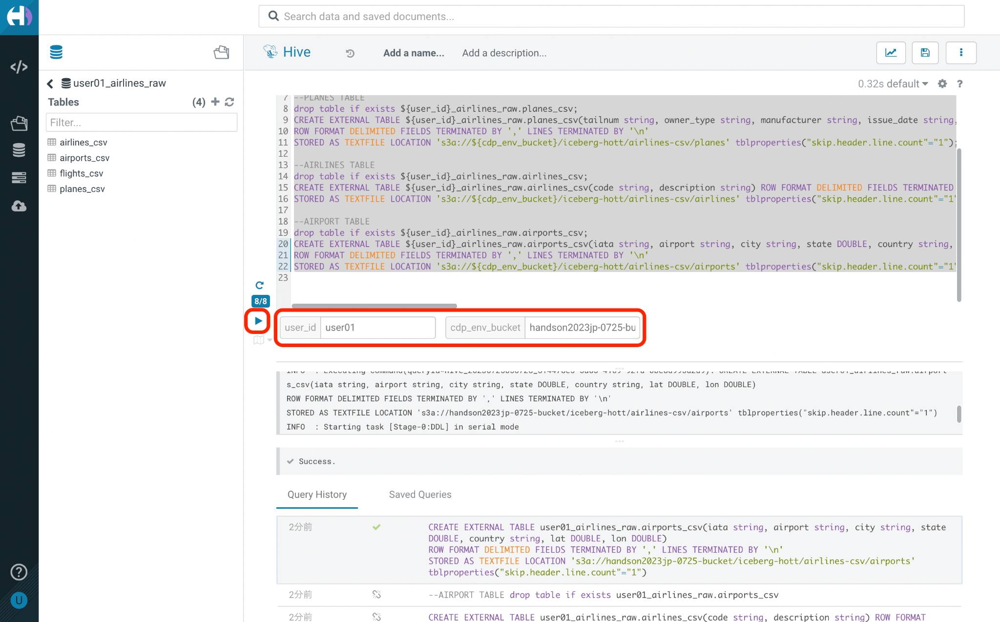


==== 手順 4 : 作成したテーブルの確認

以下のSQLでテーブルが作成されたことを確認します。

${user_id} は各自のユーザ名を入力します。

複数行を実行する場合は、実行するSQLをハイライトしてください。

```sql
USE ${user_id}_airlines_raw;
SHOW TABLES;
```


下記のように4つのテーブルが作成されていることを確認してください。

image:img_8.png[]


==== 手順 5 : Impalaからのデータアクセス

Hive で作成されたテーブルには Impala でもアクセスできます。

Data Warehouse コンソール画面に戻ります。Impala Virtual Warehouse Name の右上にある HUE アイコンをクリックします。

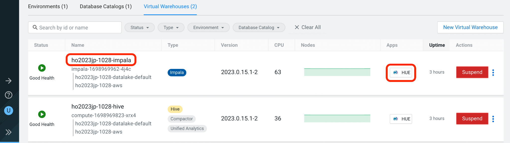


以下のSQLを実行し、flight_csv テーブルにアクセスできることを確認します。

${user_id} は各自のユーザ名を入力します。

```sql
select count(*) from ${user_id}_airlines_raw.flights_csv;
```


image:img_10.png[]

今日はこのあと、大量データ(8600万件)の入ったflightsのデータを使いながら、 Iceberg の基本的な使い方や機能、パフォーマンスを体験していきます。

データ処理を考える上で、データの性質（中身、構造）を把握しておくことはとても重要です。
ということで、データの中身をもう少し詳細に確認してみましょう。

以下のSQLで、flightデータの最初の10を表示します。
どんな列があり、各列にどんな値が入っているのかを確認しましょう。

```sql:最初の10行を確認
SELECT * FROM ${user_id}_airlines_raw.flights_csv
limit 10;
```

以下のSQLで、flightデータが各年ごとに何件入っているのかを確認します。
（このあとの演習で、年や月ごとにパーティションを切る体験をします）

```sql:各yearごとに何件のレコードが入っているかを確認
SELECT year, COUNT(*)
FROM ${user_id}_airlines_raw.flights_csv
group by year
order by year asc;
```

== ラボ 3 - ICEBERGテーブルの作成

---

このワークショップでは、Iceberg テーブルを作成する3つの方法を見ていきます。

既に Cloudera Data Warehouse を利用している場合は、既に多数の Hive テーブルが利用されていることが想定されます。

Iceberg では既存の Hive テーブルを再作成することなく、Iceberg テーブルへ移行できる In-place migration がサポートされています。

Iceberg を新規に作成する手順の他、既存の Hive テーブルから移行する方法を含め、3つの Iceberg テーブル作成方法を見ていきます。


|===
| *Table Micgration* *In-Place* | *Table Migration* *CTAS/RTAS*  
| image:img_13.png[]            | 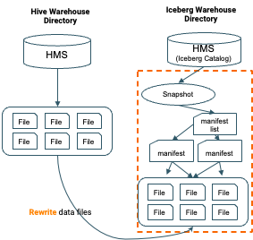             
|===


ここからの操作は再びHiveで実行します。

Data Warehouse コンソールから、Hive Virtual Warehouse をクリックし、HUEにアクセスします。

image:img_15.png[]


=== Iceberg テーブルの新規作成

Icerberg テーブルフォーマットでパーティション化されたテーブルを新規に作成します。

作成したテーブルを集計しパーティションの効果も復習します。


ワークショップで一番大きな flights テーブルを Icerberg フォーマットで作成します。

テーブルフォーマットは、STORED *BY* 句で指定することに注意してください。

（Parquet や ORC などストレージ形式は STORED *AS* 句で指定）


${user_id} は各自のユーザ名を入力します。

複数行を実行する場合は、実行するSQLをハイライトしてください。

```sql
-- テーブルが既に存在していた場合は削除
drop table if exists ${user_id}_airlines.flights;

CREATE EXTERNAL TABLE ${user_id}_airlines.flights 
(
month int, dayofmonth int, dayofweek int, deptime int, crsdeptime int, arrtime int, crsarrtime int, uniquecarrier string, flightnum int, tailnum string, actualelapsedtime int, crselapsedtime int, airtime int, arrdelay int, depdelay int, origin string, dest string, distance int, taxiin int, taxiout int, cancelled int, cancellationcode string, diverted string, carrierdelay int, weatherdelay int, nasdelay int, securitydelay int, lateaircraftdelay int
)
PARTITIONED BY (year int)    -- カラムyearの値でパーティション分割
STORED BY ICEBERG            -- Icebergテーブルフォーマットを使用
STORED AS PARQUET            -- ストレージは Parquet 形式
tblproperties ('format-version'='2');   -- Icerberg のフォーマットバージョンは Version 2

-- テーブル情報の表示
SHOW CREATE TABLE ${user_id}_airlines.flights;
```


image:img_16.png[]


SHOW CREATE TABLE 文は CREATE TABLE 文を再現することで、テーブルの属性情報を表示します。内容は DESCRIBE FORMATTED 文とほぼ同じです。

PARTITIONED BY SPEC 句を探し、"year”カラムでパーティションが作成されていることを確認します。

image:img_17.png[]


以下の属性を確認し、Icebergテーブルとして作成されていることを確認します。


|===
| *RAW FORMAT SERDE*                                                                 | SerDeライブラリとしてIcebergが使用されていますorg.apache.iceberg.mr.hive.HiveIcebergSerDe.           
| *STORED BY*                                                                        | ストレージハンドラーとしてIcebergが使用されていますorg.apache.iceberg.mr.hive.HiveIcebergStorageHandler.  
| *Location*                                                                         | クラウドストレージ（S3）上のパスが表示されます。これは Hive テーブルと同様です。                                        
| *TBLPROPERTIES. metadata_location*                                                 | Iceberg のメタ情報ファイルの場所を示します。                                                          
| *TBLPROPERTIES. table_type*                                                        | ICEBERG テーブルフォーマットであることを示します。                                                       
|===


実際にテーブルにデータを INSERT してみましょう。

シンプルな INSERT SELECT 文を使用しますが、”year”カラムの値ごとにパーティションに分割して登録されます。


${user_id} は各自のユーザ名を入力します。

複数行を実行する場合は、実行するSQLをハイライトしてください。

この操作は少し時間がかかります。

```sql
INSERT INTO ${user_id}_airlines.flights
SELECT * FROM ${user_id}_airlines_raw.flights_csv
WHERE year <= 2006;
```


image:img_18.png[]


パーティションを使うことで、GROUP BY を使ったグループ別の集計を高速に処理することができます。パーティション化された flights テーブルと、rawデータの flights_csv テーブルのそれぞれで、以下のSQLを実行し処理時間を比較してみましょう。


パーティション化された flights テーブルの集計。

${user_id} は各自のユーザ名を入力します。

```sql
SELECT year, count(*)
FROM ${user_id}_airlines.flights
GROUP BY year
ORDER BY year desc;
```


集計は数秒で完了します。

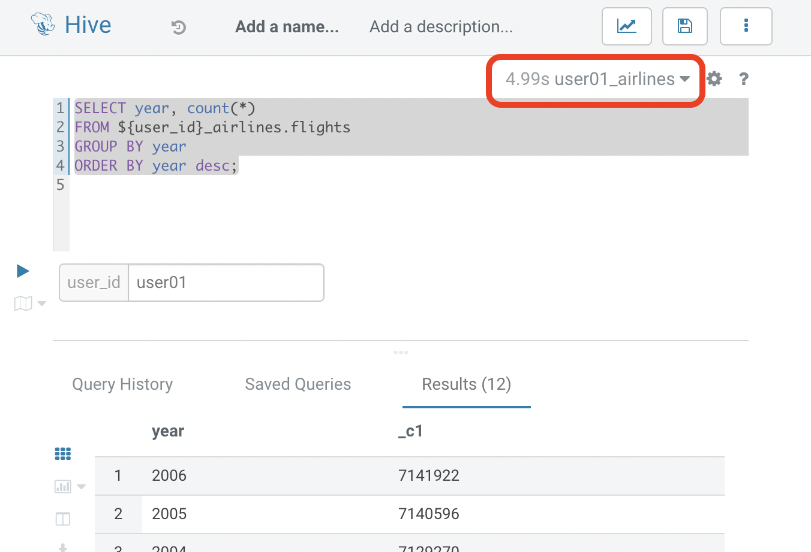


パーティション化されていない flights_csv テーブルを集計します。

${user_id} は各自のユーザ名を入力します。

この処理は少し時間がかかります。

```sql
SELECT year, count(*)
FROM ${user_id}_airlines_raw.flights_csv
GROUP BY year
ORDER BY year desc;
```


この集計では数分を要します。

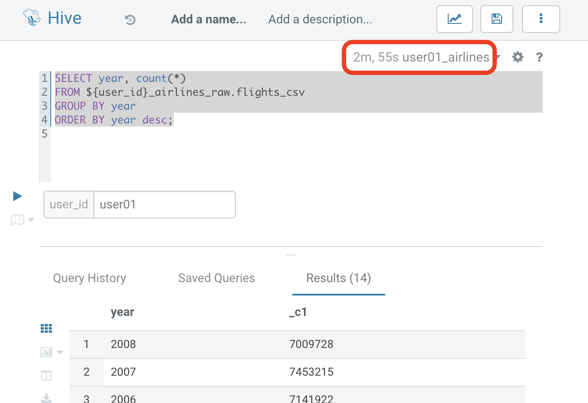


=== 既存のテーブルをIceberg形式へ変更 (In-place migration)

既に運用中の Data Warehouse で使われている Hive テーブルを、そのままIcebergへ移行することが可能です。


はじめに移行元となるHiveテーブルを作成します。以下のSQLで planes テーブルを Parquet 形式で作成します。

${user_id} は各自のユーザ名を入力します。

複数行を実行する場合は、実行するSQLをハイライトしてください。

```sql
-- テーブルが既に存在していた場合は削除
drop table if exists ${user_id}_airlines.planes;

CREATE EXTERNAL TABLE ${user_id}_airlines.planes 
(
  tailnum STRING, owner_type STRING, manufacturer STRING, issue_date STRING,
  model STRING, status STRING, aircraft_type STRING,  engine_type STRING, year INT
)
STORED AS PARQUET                  -- ストレージフォーマットはParquet
TBLPROPERTIES (
  'external.table.purge'='true'    -- テーブルが削除された場合、実ファイルも削除する
);
```


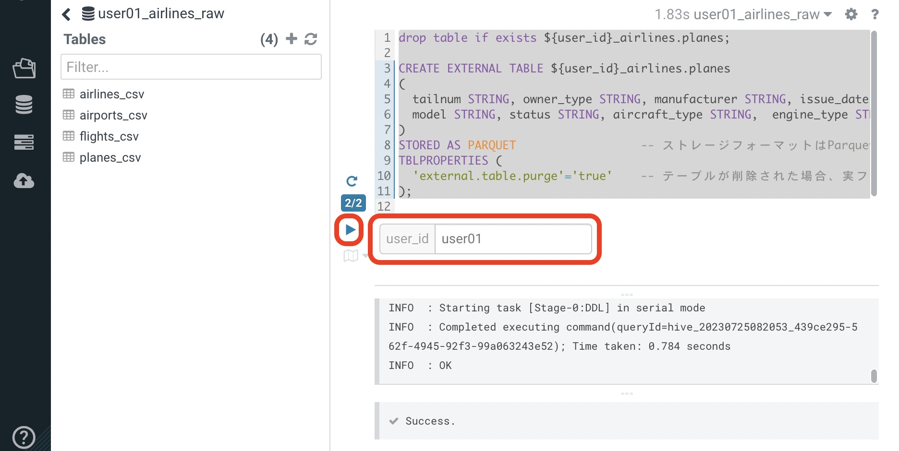


次に planes_csv テーブルからデータを登録します。

${user_id} は各自のユーザ名を入力します。

```sql
INSERT INTO ${user_id}_airlines.planes
  SELECT * FROM ${user_id}_airlines_raw.planes_csv;
```


image:img_22.png[]


テーブル作成が完了したら以下のSQLを実行して、データが正しく追加されているか確認しましょう。

${user_id} は各自のユーザ名を入力します。

```sql
SELECT * FROM ${user_id}_airlines.planes LIMIT 100;
```


以下のような結果が得られれば成功です。

image:img_23.png[]


以下のSQLを実行し、作成された Parqet テーブルの属性情報を確認します。

${user_id} は各自のユーザ名を入力します。

```sql
DESCRIBE FORMATTED ${user_id}_airlines.planes;
```


SQLの実行結果から以下の箇所を確認します。


|===
| Location                                                                                     | s3a:// _bucket_name_ /data/warehouse/tablespace/external/hive/ _user_id_ _airlines.db/planes | 新しいテーブルはインプットのCSVとは別のディレクトリに保存され /warehouse ディレクトリ配下にテーブル名に応じたディレクトリが作成されます                   
| Table Type                                                                                   | EXTERNAL_TABLE                                                                               | CREATE EXTERNAL 文により外部テーブルとなっています                                                             
| SerDe Library                                                                                | org.apache.hadoop.hive.ql.io.parquet.serde.ParquetHiveSerDe                                  | STORED AS 句で指定されたフォーマットに準じたSerDe(Serializer/Desirializer)が設定されます                              
|===


実際の画面では枠線内の項目を確認してください。

image:img_24.png[]


作成した planes テーブルを Iceberg テーブルへ移行します。

テーブルに対する ALTER 文により移行は行われます。


${user_id} は各自のユーザ名を入力します。

複数行を実行する場合は、実行するSQLをハイライトしてください。

```sql
ALTER TABLE ${user_id}_airlines.planes
SET TBLPROPERTIES ('storage_handler'='org.apache.iceberg.mr.hive.HiveIcebergStorageHandler');

DESCRIBE FORMATTED ${user_id}_airlines.planes;
```


このSQLを実行することにより、以下のような変更が行われます。

* テーブルそのものが Iceberg フォーマットに変更されます（In-placeマイグレーション）。
* ファイルのストレージフォーマットは変更されません。既存の Parquet 形式が継承されます。
* メタ情報だけが変更されます。DESCRIBE FORMATTED 文により、変更されたメタ情報を確認します。 


|===
| *Location*                                                           | データファイルの場所は変更されず、引き続きクラウドストレージ（S3）に置かれています。これは Hive テーブルのときの場所と同じです。  
| *Table Type*                                                         | テーブルは外部テーブル（EXTERNAL TABLE）です、                                        
| *Table Parameters: MIGRATED_TO_ICEBERG*                              | 値は”TRUE”で、Icerberg テーブルへ移行されたことを示します。                                 
| *Table Parameters: table_type*                                       | ICEBERG テーブルフォーマットであることを示します。                                         
| *Table Parameters: metadata_location*                                | Iceberg のメタ情報ファイルの場所を示します。                                            
| *Table Parameters: storage_handler*                                  | org.apache.iceberg.mr.hive.HiveIcebergStorageHandler.                 
| *SerDe Library*                                                      | org.apache.iceberg.mr.hive.HiveIcebergSerDe.                          
|===


Iceberg テーブルへの In-place マイグレーションの前後では以下のテーブルプロパティに変化が現れます。


|===
| *項目*                                                                                         | Hiveテーブル                                                                                     | Icebergテーブル                                                                                   
| *Location*                                                                                   | s3a:// _bucket_name_ /data/warehouse/tablespace/external/hive/ _user_id_ _airlines.db/planes | → 変更なし                                                                                        
| *Table Type*                                                                                 | EXTERNAL_TABLE                                                                               | → 変更なし                                                                                        
| *Table Parameters:**MIGRATED_TO_ICEBERG*                                                     | パラメータなし                                                                                      | true                                                                                          
| *Table Parameters:+table_type*                                                               | パラメータなし                                                                                      | ICEBERG                                                                                       
| *Table Parameters:+metadata_location*                                                        | パラメータなし                                                                                      | Iceberg のメタ情報ファイルの場所を示します。                                                                    
| *Table Parameters:+storage_handler*                                                          | パラメータなし                                                                                      | org.apache.iceberg.mr.hive.HiveIcebergStorageHandler.                                         
| *SerDe Library*                                                                              | org.apache.hadoop.hive.ql.io.parquet.serde.ParquetHiveSerDe                                  | org.apache.iceberg.mr.hive.HiveIcebergSerDe.                                                  
|===


=== 既存のテーブルをコピーしてIcebergテーブルを作成 (CTAS)

CTAS 構文により Iceberg フォーマットの airports テーブルを作成します。

テーブルフォーマットの指定は、STORED *BY* 句であることに注意してください。

（Parquet や ORC などストレージ形式は STORED *AS* 句で指定）


${user_id} は各自のユーザ名を入力します。

複数行を実行する場合は、実行するSQLをハイライトしてください。

```sql
-- テーブルが既に存在していた場合は削除
drop table if exists ${user_id}_airlines.airports;

-- CTAS構文
CREATE EXTERNAL TABLE ${user_id}_airlines.airports
STORED BY ICEBERG    -- Icebergフォーマットで保存 
AS
  SELECT * FROM ${user_id}_airlines_raw.airports_csv;

-- テーブル情報の表示
DESCRIBE FORMATTED ${user_id}_airlines.airports;
```


Table Migration とは 異なり、CTAS では新しい Iceberg テーブルが作成されます。

DESCRIBE FORMATTED 文の結果から、各属性情報を確認します。


|===
| *Location*                                            | クラウドストレージ（S3）のパスが示されています。今回は新しいパスが作成されていることを確認します。     
| *Table Type*                                          | テーブルは外部テーブル（EXTERNAL TABLE）です、                         
| *Table Parameters: MIGRATED_TO_ICEBERG*               | 新規テーブル作成なのでありません。                                      
| *Table Parameters: table_type*                        | ICEBERG テーブルフォーマットであることを示します。                          
| *Table Parameters: metadata_location*                 | Iceberg のメタ情報ファイルの場所を示します。                             
| *Table Parameters: storage_handler*                   | org.apache.iceberg.mr.hive.HiveIcebergStorageHandler.  
| *SerDe Library*                                       | org.apache.iceberg.mr.hive.HiveIcebergSerDe.           
|===


== ラボ 4 - ICEBERGの機能

---


このラボでは Iceberg の新機能を見ていきます。

従来型のテーブルフォーマットでは実現できなかったようなテーブルの保守やパフォーマンスの最適化を行います。


Data Warehouse コンソールから、自分の Hive Virtual Warehouse をクリックし、HUEにアクセスします。

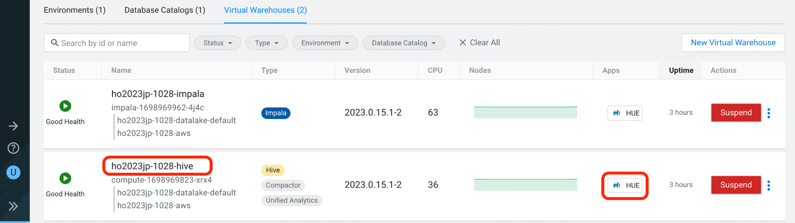


=== パーティションの最適化(Iceberg in-place Partition Evolution)

Iceberg ではパーティションの構成を後から変更することができ、特徴的な機能のひとつとなっています。


前の手順で作成した flights テーブルは、year でパーティションを作成し、年単位でストレージ領域を分割していました。

将来的にデータ量が増えてくると、年単位の分割では十分なパフォーマンスを得られないかもしれません。

そのようなケースを想定して、今後追加するデータについては、月別にパーティション分割することとします。


従来型の Hive テーブルでは、パーティション構成を変更するにはテーブルの再構築が必要でしたが、Iceberg テーブルでは既存のテーブルを維持したまま構成変更を行うことが可能です。


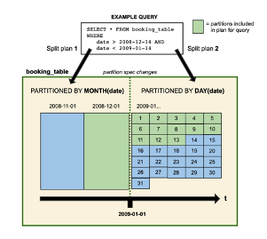

パーティションの構成を変更するには ALTER TABLE 文を使用します。

それでは flights テーブルのパーティション構成を変更してみましょう。


${user_id} は各自のユーザ名を入力します。

複数行を実行する場合は、実行するSQLをハイライトしてください。

```sql
ALTER TABLE ${user_id}_airlines.flights    -- テーブル構成の変更
SET PARTITION spec ( year, month );        -- パーティションキーをyear, monthに変更

SHOW CREATE TABLE ${user_id}_airlines.flights;
```


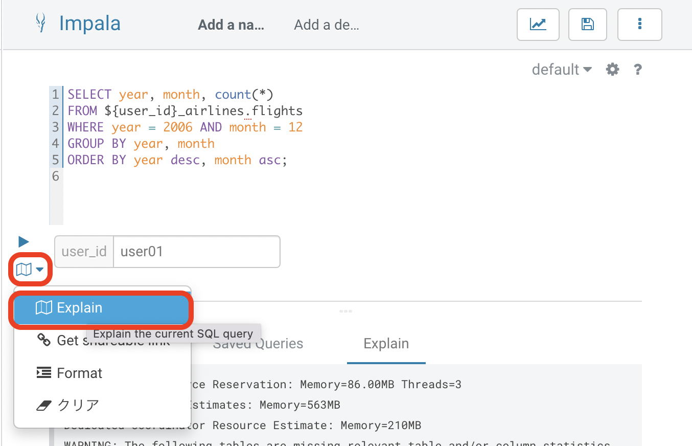

SHOW CREATE TABLE 文の結果からパーティション構成が変更されていることを確認します。

image:img_28.png[]

これ以降に追加されるデータは、新しいパーティション定義に従って追加されます。


flights テーブルに新しいデータを追加します。

${user_id} は各自のユーザ名を入力します。

複数行を実行する場合は、実行するSQLをハイライトしてください。

この操作は少し時間がかかります。

```sql
INSERT INTO ${user_id}_airlines.flights
SELECT * FROM ${user_id}_airlines_raw.flights_csv
WHERE year = 2007;
```


image:img_29.png[]


SQLの実行計画にどのような変化が現れるかを確認します。この操作は Impala で行います。

Data Warehouse コンソールから、自分の Impala Virtual Warehouse をクリックし、HUEにアクセスします。

image:img_30.png[]


はじめにパーティション構成変更前に登録された、year = 2006 のパーティションの状態を確認します。

SQLエディタに以下のSQLを貼り付けますが、 *実行しないでください。*

```sql
SELECT year, month, count(*)
FROM ${user_id}_airlines.flights
WHERE year = 2006 AND month = 12
GROUP BY year, month
ORDER BY year desc, month asc;
```


SQLを実行せずに実行計画を確認するために、SQL実行ボタンの下にあるドロップダウンを展開し、Explain をクリックします。

image:img_31.png[]

実行計画を確認します。パーティション内のファイルサイズが100MB以上であることを確認します。

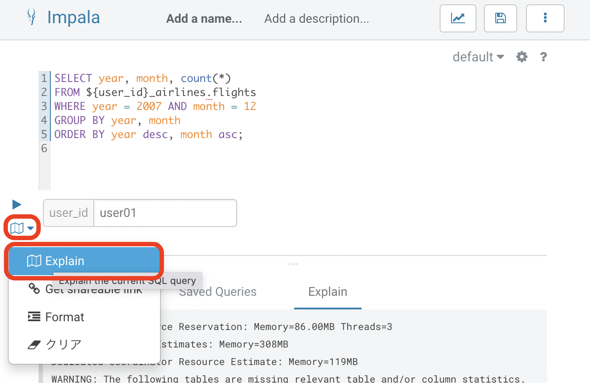


次にパーティション構成変更前に登録された、year = 2007 のパーティションの状態を確認します。

SQLエディタに以下のSQLを貼り付けますが、 *実行しないでください。*

```sql
SELECT year, month, count(*)
FROM ${user_id}_airlines.flights
WHERE year = 2007 AND month = 12
GROUP BY year, month
ORDER BY year desc, month asc;
```


同様に、SQL実行ボタンの下にあるドロップダウンを展開し、Explain をクリックします。

image:img_33.png[]


実行計画を確認します。パーティション内のファイルサイズが10MB程度となっています。

このデータは1年につき100MB前後のデータですが、パーティションを年月(year,month)で分割したことで約1/12のサイズとなりました。

パーティション分割することによって、一度にアクセスするデータ量を減らすことができます。これは Iceberg のテーブル設計の重要な要素のひとつです。

image:img_34.png[]


=== スナップショット

ここまでで何回かに渡り flights テーブルにデータを追加してきました。この後、さらにデータを追加していきます。この時、Iceberg ではデータを追加する都度、スナップショットが保存されます。スナップショットには、追加されたデータのメタ情報（ファイル名やタイムスタンプなど）が記録されます。


今回のデータ追加は Impala で実行します。

${user_id} は各自のユーザ名を入力します。

```sql
INSERT INTO ${user_id}_airlines.flights
SELECT * FROM ${user_id}_airlines_raw.flights_csv
WHERE year >= 2008;
```


image:img_35.png[]


データの追加が完了したら、DESCRIBE HISTORY 文でこれまでに作成されたスナップショットを確認します。

${user_id} は各自のユーザ名を入力します。

```sql
DESCRIBE HISTORY ${user_id}_airlines.flights;
```


image:img_36.png[]


year 別に3回データの追加を行ったので、3つのスナップショットが作られています。


スナップショットの値をメモ帳などに貼り付けて保存してください。

左側のダウンロードアイコンから、CSVやExcelなどの形式で保存することも可能です。

この後のタイムトラベル機能で使用します。


image:img_37.png[]


=== タイムトラベル

記録したスナップショットIDを使って、スナップショット作成時のデータにアクセスすることができます。

スナップショットを使用するには、FOR SYSTEM_TIME AS OF 句、FOR SYSTEM_VERSION AS OF 句を使用します。


はじめに下記のSQLをSQLエディタに貼り付けてください。

SQLは *実行しないでください。*

```sql
-- スナップショットタイムスタンプによるアクセス
SELECT year, count(*)
FROM ${user_id}_airlines.flights
  FOR SYSTEM_TIME AS OF '${create_ts}'       -- タイムスタンプを指定
GROUP BY year
ORDER BY year desc;

-- スナップショットIDによるアクセス
SELECT year, count(*)
FROM ${user_id}_airlines.flights
  FOR SYSTEM_VERSION AS OF ${snapshot_id}    -- スナップショットIDを指定
GROUP BY year
ORDER BY year desc;
```


SQLを貼り付けると *create_ts* と *snapshot_id* の2つのボックスが表示されます。

image:img_38.png[]


メモ帳に保存したタイムスタンプから1番最初のものを create_ts ボックスに貼り付けます。

（この例では、2023-04-04 06:51:14.360000000 です）


ひとつ目のSQLだけをハイライトして実行します。

最新のデータは year = 2008 のデータまで追加されていますが、このタイムスタンプで追加された year = 2006 以前のデータだけが返ってくることを確認します。

${user_id} は各自のユーザ名を入力します。

image:img_39.png[]


メモ帳に保存したスナップショットIDから2番目のものを snapshot_id ボックスに貼り付けます。

（この例では、6341506406760449831 です）


二つ目のSQLだけをハイライトして実行します。

最新のデータは year = 2008 のデータまで追加されていますが、このタイムスタンプで追加された year = 2007 以前のデータだけが返ってくることを確認します。

${user_id} は各自のユーザ名を入力します。

image:img_40.png[]


=== ロールバック　※実行しないでください

時々データは正しくロードされないことがあります。項目の欠損や不正データなど様々な要因が考えられます。

このような場合、不正なデータを正しく削除して、もう一度データをロードしなければいけません。


Iceberg ではロールバックコマンドがサポートされており、このようなケースで役立ちます。

スナップショットIDを使ったロールバックでは、ALTER TABLE 文で EXECUTE ROLLBACK 句を使用します。

以下はSQLの例です。 *ここでは実行しないでください。*

```sql
-- ALTER TABLE ${user_id}_airlines.flights EXECUTE ROLLBACK(${snapshot_id});
```

=== スナップショットの保守　※実行しないでください

また時間の経過とともに、非常に古いスナップショットは不要となってきます。そのような場合にはスナップショットを無効化することができます。

スナップショットを無効化するには、ALTER TABLE 文の EXECUTE 句で、expire_snapshots() 関数を使用します。

以下はSQLの例です。 *ここでは実行しないでください。*

```sql
-- 指定したタイムスタンプまでのスナップショットを無効化します
-- 無効化されたスナップショットによるタイムトラベルは不可能となります
-- ALTER TABLE ${user_id}_airlines_maint.flights EXECUTE expire_snapshots('${create_ts}');
```


**__これでワークショップは完了です。__**

**__データ利活用のための新しい発見や気づきがあれば幸いです。__**

